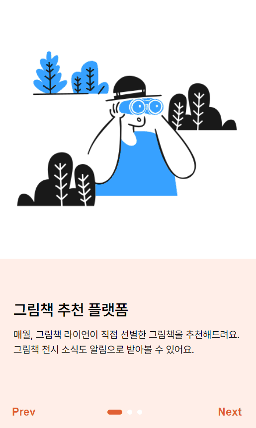
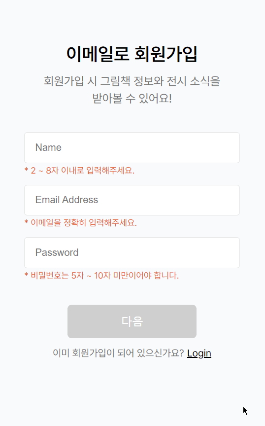
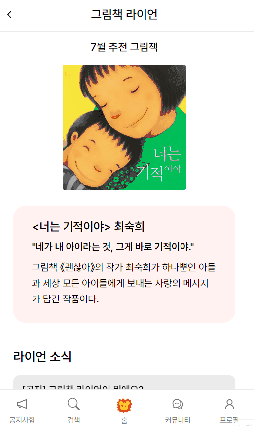

# 프로젝트 소개


그림책 라이언은 그림책 정보를 공유하는 그림책 커뮤니티 플랫폼 입니다.  
함께 공유하고 싶은 그림책을 독서 노트에 작성해보세요!  
💌 그림책 전시, 행사 소식을 <b>'라이언 🦁'</b> 이 빠르게 전달해드립니다.

## 배포

[그림책 라이언](https://artbook-lion.netlify.app)

## 로그인 제공

이메일 : lionbooks@lionbooks.com  
비밀번호 : lionbooks

## 개발 환경

React  
react-router-dom  
redux-toolkit, redux-persist  
axios  
styled-components  
Firebase authentication, storage

## 디자인

[Figma 로직 디자인](https://www.notion.so/injilee/251a57aae3cd4c208ce9de17766c0a7d?pvs=4#7c76c1b4d53a439c8f240cf491518831)

# 구현 기능

### [onboarding]



### [login]


### [signin]



### [home]



### [notice]


### [search]


### [뒤로가기 시 데이터 유지]


### [profile edit]


# 주요 코드

## 1. 마우스 가로 스크롤

동작할 요소 : 스크롤 할 컨텐츠가 담긴 부모 요소  
이벤트 핸들러 : onMouseDown, onMouseUp, onMouseLeave이벤트가 발생하면  
handleMouseEvent() 함수 실행. onMouseMove 이벤트가 발생하면 handleScrollMove() 함수 실행.

> → onMouseDown : 컨텐츠 위에서 마우스를 클릭한 경우 (start)  
> → onMouseUp : 컨텐츠 위에서 마우스 클릭을 중단한 경우 (end)  
> → onMouseLeave : 마우스가 컨텐츠 영역을 벗어난 경우 (leave)  
> → onMouseMove : 마우스가 이동한 경우

```jsx
const handleScrollMove = e => {
   const x = position + startX - e.clientX;

   if (isScroll) {
      containerRef.current.scrollLeft = `${x}`;
   }
   return;
};

const handleMouseEvent = (e, scroll) => {
   switch (scroll) {
      case 'start':
         setStartX(e.clientX);
         setIsScroll(true);
         break;

      case 'end':
         setposition(containerRef.current.scrollLeft);
         setIsScroll(false);
         break;

      case 'leave':
         setIsScroll(false);
         break;

      default:
         break;
   }
};
```

터치 스크롤 동작 : 마우스 스크롤이 어떻게 동작 되는지 처음에는 이해하기 어려웠다. 이해하기 위해 직접 손으로 여러 번 스크롤 동작을 해보면서 손이 움직이는 모든 과정을 하나씩 따라갔다.

<details>
<summary style="font-size: 18px">스크롤 과정</summary>
<div markdown="1">

1. 컨텐츠 영역 안에서의 마우스 위치 파악한다. 클릭하지 않고 이동하는 마우스의 모든 위치를 말한다.

2. 컨텐츠 영역 안에서 어느 한 지점을 클릭을 하기 위해서는 마우스를 멈춰야 한다. 마우스 클릭 시작 지점이다.

3. 클릭을 중단하기 위해서도 마우스를 멈춰야 한다. 마우스 클릭 마지막 지점이다.

4. 클릭한 상태의 지점에서 클릭을 유지하며 마우스를 어느 지점까지 이동한 만큼 전체 컨텐츠의 위치도 이동해야 한다.

5. 마우스 클릭 지점의 위치 - 마우스 클릭 중단 전 멈춘 위치 = 클릭 지점으로부터 이동한 거리

6. 최초 스크롤 시 position 값은 0이다. 두 번째 스크롤부터 이동한 거리의 값에 따라 전체 컨텐츠의 위치도 이동하게 된다. 이 전체 컨텐츠가 이동한 위치값이 position이다.

7. 전체 컨텐츠가 이동한 위치를 기억하고 있다가 다음 스크롤 때 이 위치값에 이동한 만큼의 거리값을 계산하면 스크롤 이동이 가능해진다. position 값을 함께 계산하지 않으면 매 스크롤 때마다 스크롤 하기 전의 위치로 되돌아가게 된다

</div>
</details>

## 2. 인증 상태 지속성

로그인한 사용자의 정보를 가져와 store에 저장하고, 로그인 된 상태를 유지하기 위해 <code>setPersistence</code>를 호출한다. 이 상태 지속성을 가지고 <code>login</code> 페이지에 접근할 경우 로그인 상태가 아닐 경우 <code>login</code> 페이지에, 로그인 상태에서 접근했을 경우에는 <code>home</code> 페이지로 이동할 수 있도록 했다. <code>useEffect</code>을 실행해 <code>onAuthChanged()</code>로 로그인 상태를 확인할 수 있다.

<code>redux-persist</code>의 <code>PURGE</code>를 이용해 로그아웃시 store에 저장된 사용자 정보를 초기화 했다.

```jsx
useEffect(() => {
   authService.onAuthChanged(user => {
      if (user !== null) {
         const profile = {
            displayName: user.displayName,
            uid: user.uid,
            email: user.email,
         };
         dispatch(setUser(profile));
         navigator('/home');
      } else if (uid) {
         navigator('/home');
      }
   });
}, [authService, dispatch, navigator, uid]);
```

```jsx
// 로그인한 사용자 정보 저장하기
export const userSlice = createSlice({
   name: 'user',
   initialState,
   reducers: {
      setUser: (state, action) => {
         state.name = action.payload.displayName;
         state.uid = action.payload.uid;

         const emailParts = action.payload.email.split('@');
         state.account = '@' + emailParts[0];
      },
      clearUser: state => {
         state.user = null;
      },
      uploadImageURL: (state, action) => {
         state.imageURL = action.payload.imageURL;
      },
   },
   extraReducers: builder => {
      builder.addCase(PURGE, () => {
         return initialState;
      });
   },
});
```

[Firebase 공식 문서](https://firebase.google.com/docs/auth/web/auth-state-persistence?hl=ko#web-modular-api)
[redux-toolkit 공식 문서](https://redux-toolkit.js.org/usage/usage-guide#use-with-redux-persist)

# 문제 해결

## 1. Netlify 배포 시 api 호출 시 html 페이지로 응답되는 문제

코드를 고쳐봐도 문제의 원인이 어디서 나온 것인지 정확히 파악하지 못해 의심가는 부분들을 테스트 해봤다. 400, 404, 500 같은 HTTP 에러는 없었다. 개발자 도구 네트워크 탭에서 api 통신 요청과 응답을 하나하나 뜯어보니 아래의 1, 2번 문제는 아니었다. 정상적으로 request 되었고 env 변수도 알맞게 들어갔다. 3, 4에서 분명히 문제가 있을 것이라 판단했고, Netlify와 Proxy에 관한 이슈들을 찾아보았고 아래의 링크들을 참고하여 코드를 수정했다.

1. ~~네이버 api url 잘못 설정~~
2. ~~env 변수 잘못 입력~~
3. Proxy 에러
4. axios 통신 코드 문제

[Create React App - Proxy](https://www.youtube.com/watch?v=VaAWIAxvj0A&t=1223s)  
[Netlify 공식 문서](https://docs.netlify.com/routing/redirects/rewrites-proxies/#app)  
[참고 블로그 링크1](https://blog.jim-nielsen.com/2020/a-cors-proxy-with-netlify/)  
[참고 블로그 링크2](https://velog.io/@newjin46/TIL-React-Netlify-%EB%B0%B0%ED%8F%AC-%EC%8B%9C-Proxy-%EC%98%A4%EB%A5%98-Router-404-%EC%98%A4%EB%A5%98-%ED%95%B4%EA%B2%B0)

기존에 만든 setupProxy.js 파일을 삭제하고 netlify.toml 파일을 새로 생성해 proxy 설정을 따로 해줬다.

```jsx
// netlify.toml
[[redirects]];
from = '/proxy/*';
to = 'https://openapi.naver.com/:splat';
status = 200;
force = true;

[[redirects]];
from = '/*';
to = '/index.html';
status = 200;
force = false;
```

```jsx
// Search.jsx
const PROXY = window.location.hostname === 'localhost' ? '' : '/proxy';
const URL = `${PROXY}/v1/search/book.json`;

const instance = axios.create({
      headers: {
         'Content-Type': 'application/json',
         Accept: 'application/json',
         'X-Naver-Client-Id': process.env.REACT_APP_NAVER_CLIENT_ID,
         'X-Naver-Client-Secret': process.env.REACT_APP_NAVER_CLIENT_SECRET,
      },
   });

async function fetchData(query) {
      try {
         const response = await instance.get(URL, {
            params: {
               query: query,
               display: 60,
               ...
```

인스턴스를 생성해준다. 여기서 공부가 부족하다고 느꼈던게, 처음에는 인스턴스를 생성하지 않고 get으로 받아오려고만 해서 제대로 api 요청이 되지 않았던 것 같다. 문제를 해결하느라 엄청난 시간을 쏟아버렸고 문제의 원인을 제대로 파악하지 못해 시간이 걸린 이유도 있었다. 네트워크 통신 공부해야겠다…😥

## 2. 도서검색 상세페이지에서 뒤로가기 시 데이터 유지하기

도서를 검색하면 도서검색 결과 목록이 나오는데, 페이지를 이동하게 되면 그 결과 목록은 따로 저장하지 않았기 때문에 사라진다. 검색어에 입력한 입력값은 저장하지 않더라도 페이지를 이동했다가 다시 돌아왔을 때, 전에 검색한 도서 목록이 그대로 남아있는 것이 편하고 좋을 것 같았다. 또한 불필요한 api 호출을 막기 위함도 있었다.

라이브러리를 사용하지 않고 localstorage에 검색 결과를 저장해도 되긴 하지만 모든 페이지 전반에 필요한 <code>사용자 정보, 로그인/로그아웃, 도서검색 결과</code> state를 한 곳에서 관리할 필요성을 느껴 (redux의 store에서 가능하다고 한다!) <code>redux</code>를 사용했다.

검색 결과 목록을 <code>redux</code>를 사용해 store에 저장했고, 페이지 이동했다가 다시 돌아와보니 store 값은 비어있었다. 페이지를 이동하거나 새로고침 했을 때 store를 유지하기 위해서는 <code>redux-persist</code>를 사용해야 한다.

```jsx
// store.jx
export const searchBookSlice = createSlice({
   name: 'searchResults',
   initialState: {
      results: [],
   },
   reducers: {
      setResults: (state, action) => {
         state.results = [...action.payload];
      },
      resetResults: state => {
         state.results = [];
      },
   },
});
```

```jsx
// Search.jsx
async function fetchData(query) {
   try {
      const response = await instance.get(URL, {
         params: {
            query: query,
            display: 60,
         },
      });
      const result = response.data.items.map(item => {
         const data = {
            title: item.title,
            image: item.image,
            author: item.author,
            description: item.description,
         };
         return data;
      });
      dispatch(setResults(result));
   } catch (error) {
      console.error(error);
   }
}
```

로그아웃 후에는 state에 저장된 이 값은 초기화 하여 다음 로그인 때 검색 정보가 남아있지 않게 resetResults() reducer로 초기화 했다.
